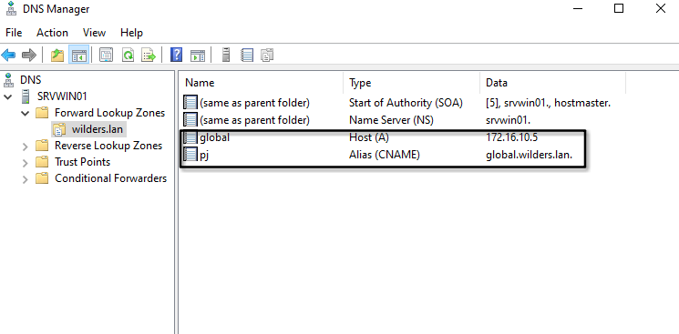
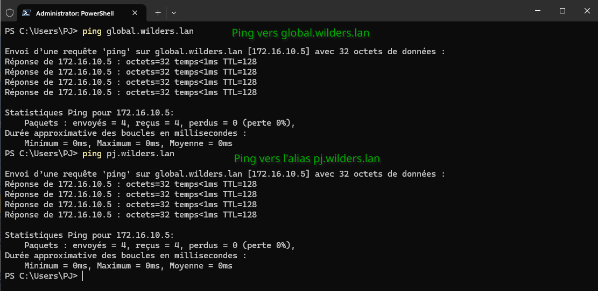
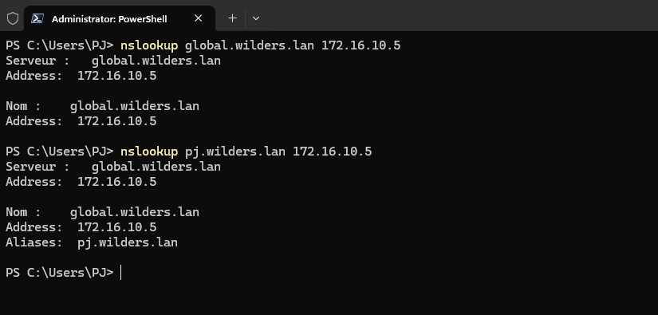

# DNS-avec-Windows-Server

### La configuration de la zone directe du serveur

### La configuration de la zone indirecte du serveur

### Un ping depuis le client vers les 2 noms DNS du serveur

### le résultat de la commande nslookup depuis le client vers le serveur DNS

